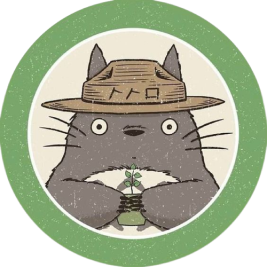
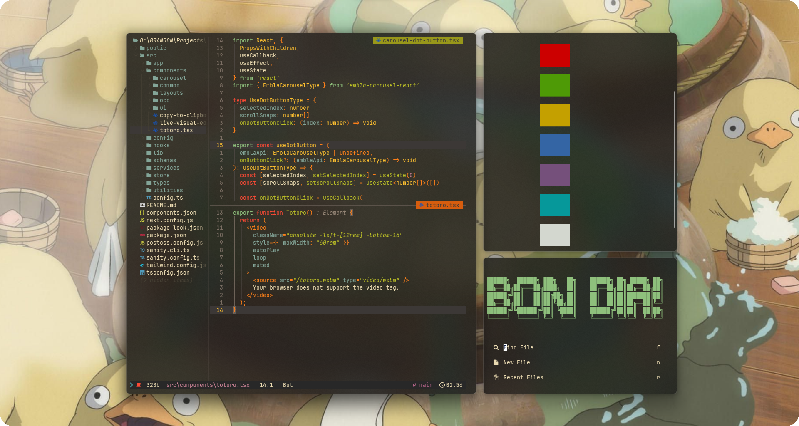
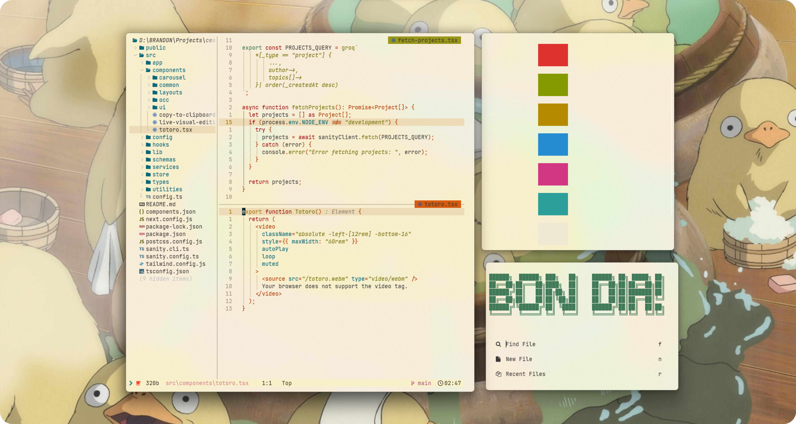
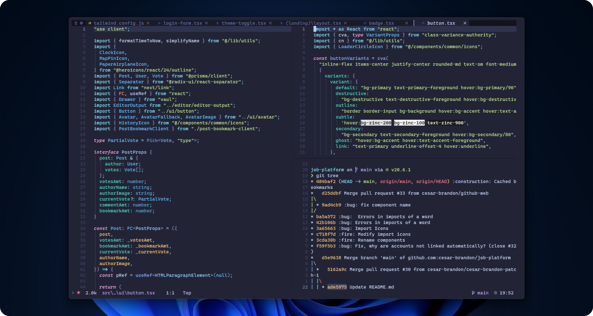

<h3 align="center">
     
    <a style="color:#79740e" href="https://github.com/neovim/neovim">(Neo)</a><a style="color:#b8bb26" href="https://github.com/vim/vim">vim</a> for Cesar Brandon
    
</h3>

  

 

 

